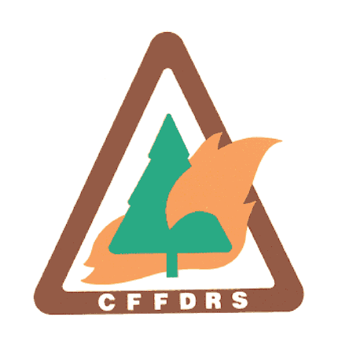

<a href="https://cffdrs.github.io/website_fr/accueil/" target="_self" style="float: right;"> Français </a>

# Home

## About

The [Canadian Forest Fire Danger Rating System (CFFDRS)](https://natural-resources.canada.ca/our-natural-resources/forests/wildland-fires-insects-disturbances/canadian-forest-fire-danger-rating-system/14470) is the principal source of fire information for all [wildland fire management agencies](https://ciffc.ca/mobilization-stats/member-agencies) across Canada. It has widespread use as a regional and fireline safety and awareness tool. The CFFDRS is undergoing extensive revisions under the name [Next Generation CFFDRS (NG-CFFDRS)](https://ostrnrcan-dostrncan.canada.ca/handle/1845/245411), with rollout to practitioners occurring during 2024, 2025, and beyond. The primary goal is to meet the evolving needs of advanced users while maintaining its original simplicity and effectiveness.

This website is intended to:

- inform users about the ongoing changes to the CFFDRS
- centralize access to the code and documentation
- host tutorials for new users

For those unfamiliar with the CFFDRS, or for official information regarding wildfires in Canada, read more on official Government of Canada pages under 
<a href="../resources/#overview" target="_self">Resources#Overview</a>.

</img>

The previous CFFDRS1992 code can still be found on the [CFFDRS GitHub](https://github.com/cffdrs), while the R documentation can be found on the [CFFDRS CRAN page](https://cran.r-project.org/web/packages/cffdrs/).

## Announcements

If you want to get email updates about the latest developments with CFFDRS2025, join our 
<a href="../contact/#newsletter-sign-up" target="_self">mailing list</a>.

### March 2025
The [first newsletter](../documents/Newsletter1_FWI2025_final.pdf)📥 is available now. It goes over the new features of the Fire Weather Index (FWI2025) including the ability to use hourly data and the introduction of outputs for grasslands.

### January 2025
The NG-CFFDRS Fire Weather Index (FWI) System module is available for users to test. Release of the other modules of the CFFDRS (e.g. FBP System, FMS, and FOP System) is ongoing.